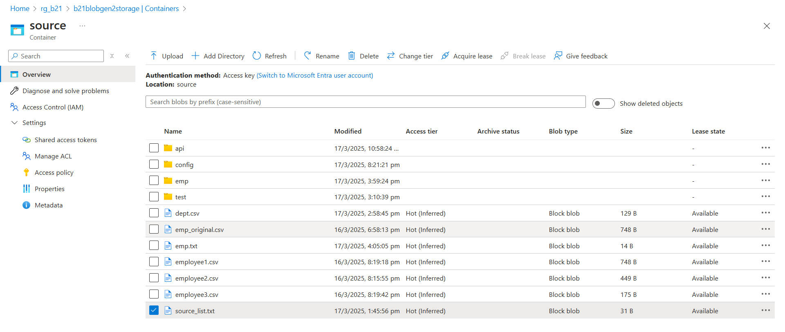
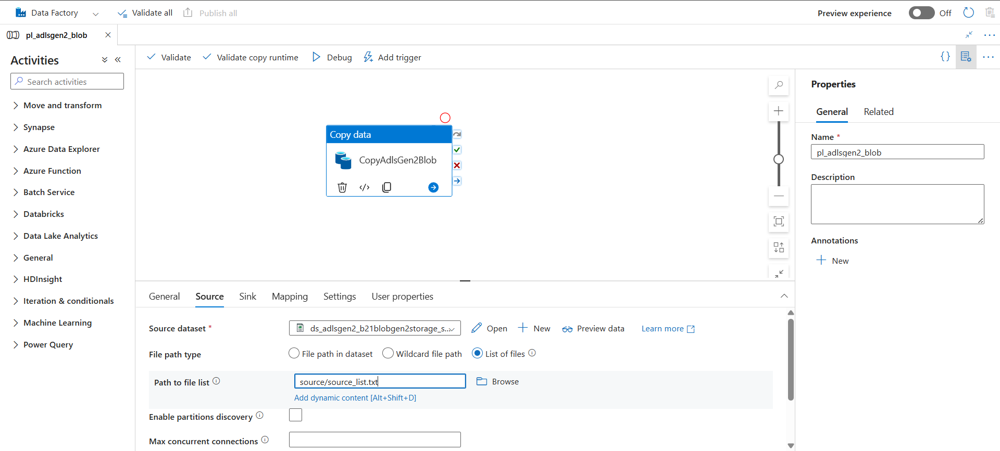
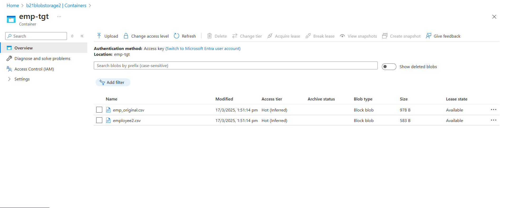

# Azure Data Factory Pipeline: ADLS Gen2 to Blob Storage

## **Overview**

This pipeline is designed to **transfer data from Azure Data Lake Storage Gen2 (ADLS Gen2) to Azure Blob Storage** using **Azure Data Factory (ADF)**. The data is stored in CSV format in both source and target.

## **Architecture Diagram**

**ADLS Gen2 → ADF → Blob Storage**




## **Prerequisites**

Before setting up the pipeline, ensure you have the following services available in Azure:

- **Azure Data Lake Storage Gen2 (ADLS Gen2)**
- **Azure Blob Storage**
- **Azure Data Factory (ADF)**
- **Required permissions** to create Linked Services and Datasets in ADF

## **Pipeline Steps**

### **1. Create Linked Services (Connections Between Services)**

Azure services are **independent** and **do not communicate internally** by default. **Linked Services** enable connections between them.

#### **1.1 Create a Linked Service for the Source**

- **Source:** ADLS Gen2
- **Linked Service Name:** `ls_adlsgen2_b21blobgen2storage`
- **Authentication:** Managed Identity / Service Principal

#### **1.2 Create a Linked Service for the Target**

- **Target:** Blob Storage
- **Linked Service Name:** `ls_blob_b21blobstorage2`

#### **Naming Convention for Linked Services**

`ls_blob_b21blobstorage2` → `[Linked Service]_[Service Type]_[Service Name]`

- `ls` → Linked Service
- `blob` → Blob Storage
- `b21blobstorage2` → Storage account name

### **2. Define Datasets for Source and Target**

A **Dataset** represents the data structure (file format, storage path) used in the pipeline.

#### **2.1 Create a Dataset for the Source**

- **Source:** ADLS Gen2
- **File Format:** CSV
- **Dataset Name:** `ds_adlsgen2_b21blobgen2storage_source`
- **Path:** Container / Directory Path

#### **2.2 Create a Dataset for the Target**

- **Target:** Blob Storage
- **File Format:** CSV
- **Dataset Name:** `ds_blob_b21blobstorage2_emp_tgt`

#### **Naming Convention for Datasets**

`ds_blob_b21blobstorage2_emp_tgt` → `[Dataset]_[Service Type]_[Service Name]_[Container Name]`

- `ds` → Dataset
- `blob` → Blob Storage
- `b21blobstorage2` → Storage account name
- `emp_tgt` → Container name

### **3. Configure the Pipeline**

- **Pipeline Name:** `pl_adlsgen2_blob`
- **Purpose:** Read data from ADLS Gen2 and write to Blob Storage
- **Activity Used:** `Copy Data Activity`

#### **3.1 Configure Copy Data Activity**

- **Source:** ADLS Gen2 Dataset (`ds_adlsgen2_b21blobgen2storage_source`)

- **Destination:** Blob Storage Dataset (`ds_blob_b21blobstorage2_emp_tgt`)

- Using List of Files Option:

  In Copy Activity, using the "List of Files" option to specify the \`source\_list\` file, which contains the list of files to be loaded into the target.

  My container also have other files apart from intended source file, so list of files option helps us to load only specified files.

#### **3.2 Execution Methods**

- **Debug Mode:** Test the pipeline before deployment
- **Trigger Now:** Immediate execution of the pipeline

## **Pipeline Execution Flow**

1. **ADF triggers the pipeline**
2. **Reads files from ADLS Gen2**
3. **Copies data to Blob Storage**
4. **Completion status logged in ADF monitoring**

## Folder Structure
```
📂 ADF-ADLSGen2-Blob-Pipeline
 ├── 📂 Pipeline            # JSON export files of ADF pipeline
 ├── 📂 Images              # Flow diagrams, linked services, and results
 ├── 📂 Datasets            # JSON export files of ADF datasets
 ├── source_list.txt        # File containing the list of source data files for processing
 └── README.md              ← (This file)
```

---
🔗 **Author**: Naveen Madala  
📧 **Contact**: madalanaveen9@gmail.com
🔗 **LinkedIn**: [https://www.linkedin.com/in/madalanaveen](https://www.linkedin.com/in/madalanaveen/)
